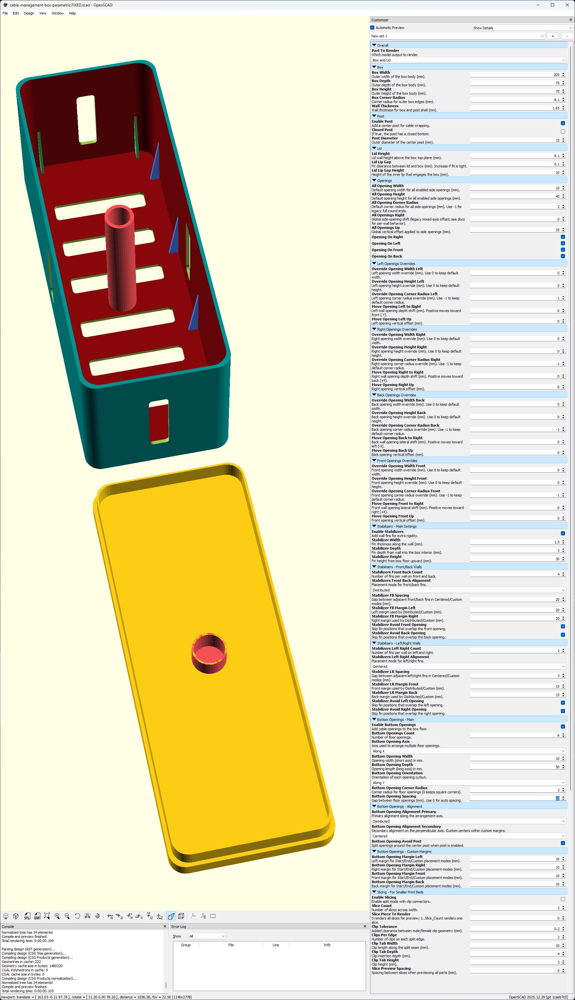

# The Ultimate Parametric Cable Management Box (OpenSCAD)

Parametric OpenSCAD model for printable cable-management boxes with configurable side openings, optional center post, optional interior stabilizers, bottom opening layouts, and print-bed slicing with clip joints.

- Repository: `https://github.com/jprisant/cable-box-parametric-openscad`
- Primary model: `cable-management-box-parametric.scad`
- License: `CC BY-NC-SA 4.0`

## Features

- Configurable box and lid dimensions.
- Per-side opening enable/disable, overrides, and offsets.
- Optional center post (open or closed post base behavior).
- Stabilizer fins with alignment and opening-avoid logic.
- Bottom opening arrays with axis/orientation/alignment controls.
- Optional slicing workflow for smaller print beds with mating clips.
- OpenSCAD smoke CI workflow (`.github/workflows/scad-smoke.yml`).

## Quick Start

1. Open `cable-management-box-parametric.scad` in OpenSCAD.
2. Open Customizer (`Window -> Customizer` or `F3`).
3. Set `Part_To_Render` and adjust parameters.
4. Run full render (`F6`).
5. Export STL.

Numeric values are intended to be edited through typed input fields and step arrows in Customizer.

## Screenshot of All the Options!

---

## Documentation Map

- Docs index: `docs/DOCS_INDEX.md`
- Docs site entry page: `docs/index.md`
- Full parameter reference: `docs/PARAMETER_REFERENCE.md`
- Module reference: `docs/MODULE_REFERENCE.md`
- Architecture deep dive: `docs/SCAD_ARCHITECTURE.md`
- Validation rules: `docs/VALIDATION_RULES.md`
- Parameter interactions: `docs/PARAMETER_INTERACTIONS.md`
- Workflow and tuning guide: `docs/WORKFLOWS.md`
- Printing recommendations: `docs/PRINTING.md`
- Frequently asked questions: `docs/FAQ.md`
- Release checklist: `docs/RELEASE.md`
- MkDocs config: `mkdocs.yml`
- Docs Pages workflow: `.github/workflows/docs-pages.yml`
- CI smoke workflow: `.github/workflows/scad-smoke.yml`
- Local smoke scripts: `scripts/scad-smoke.ps1`, `scripts/scad-smoke.sh`

## Project Structure

- SCAD source: `cable-management-box-parametric.scad`
- Curated preset library (planned/active): `library/`
- Initial preset artifacts: `library/v1-default/`
- Community-contributed builds: `community/`
- CI workflow: `.github/workflows/scad-smoke.yml`
- Local smoke scripts: `scripts/`

See:

- `library/README.md` for preset packaging expectations (images + STLs + config metadata).
- `community/README.md` for contribution layout and quality guidance.

## Contributing

- Contribution guide: `CONTRIBUTING.md`
- Code of conduct: `CODE_OF_CONDUCT.md`
- Security policy: `SECURITY.md`

For behavior changes, update source comments and related docs in the same PR.

## Validation

- GitHub Actions smoke workflow: `.github/workflows/scad-smoke.yml`
- Local Windows smoke runner: `scripts/scad-smoke.ps1`
- Local Bash smoke runner: `scripts/scad-smoke.sh`
- Optional override for Bash runner: set `OPENSCAD_BIN` if `openscad` is not in PATH.

Smoke scenarios cover baseline rendering, lid rendering, slicing rendering, and one expected-fail assertion case.

## Licensing

Repository content is licensed under `CC BY-NC-SA 4.0` unless otherwise noted.

- Full license text: `LICENSE`
- Third-party attribution and license details: `THIRD_PARTY_NOTICES.md`

Embedded or derived third-party code keeps its original license terms.